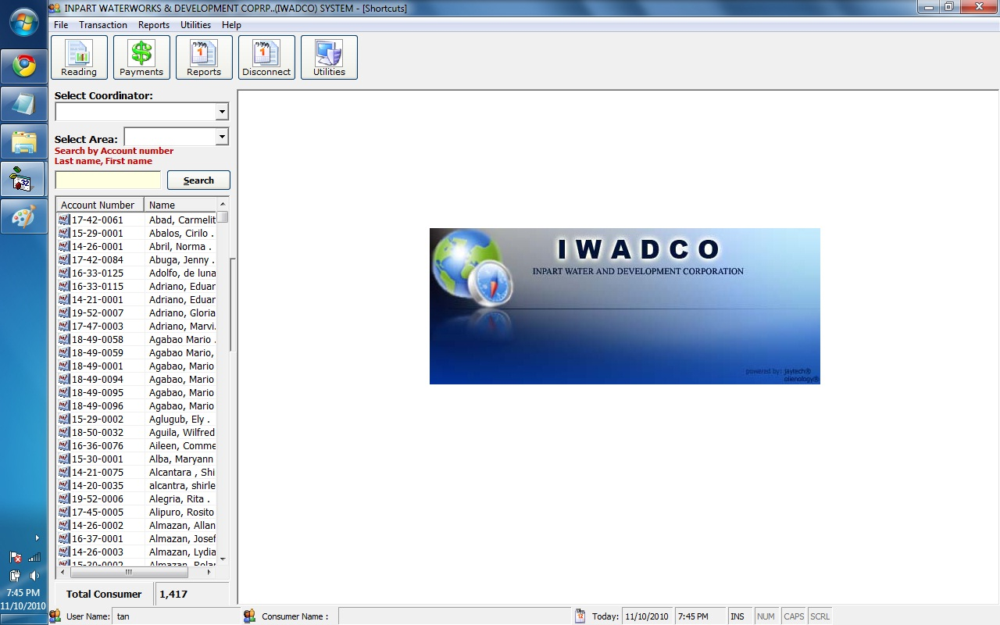



## Water Billing System

### Description

It was design to handle complicated computation and relational, hope you find it usefull in your learning, i use SQL SERVER 2000 For the database which can be use in LAN / StandAlone, hope you enjoy this.. pls give a vote on this one =)
 
### More Info
 

             |
---                |---
**Submitted On**   |2010-11-11 19:03:30
**By**             |[Angelito Tan](https://github.com/Planet-Source-Code/PSCIndex/blob/master/ByAuthor/angelito-tan.md)
**Level**          |Advanced
**User Rating**    |4.5 (27 globes from 6 users)
**Compatibility**  |VB 6\.0
**Category**       |[Databases/ Data Access/ DAO/ ADO](https://github.com/Planet-Source-Code/PSCIndex/blob/master/ByCategory/databases-data-access-dao-ado__1-6.md)
**World**          |[Visual Basic](https://github.com/Planet-Source-Code/PSCIndex/blob/master/ByWorld/visual-basic.md)
**Archive File**   |[Water\_Bill21928211142010\.zip](https://github.com/Planet-Source-Code/angelito-tan-water-billing-system__1-73590/archive/master.zip)

